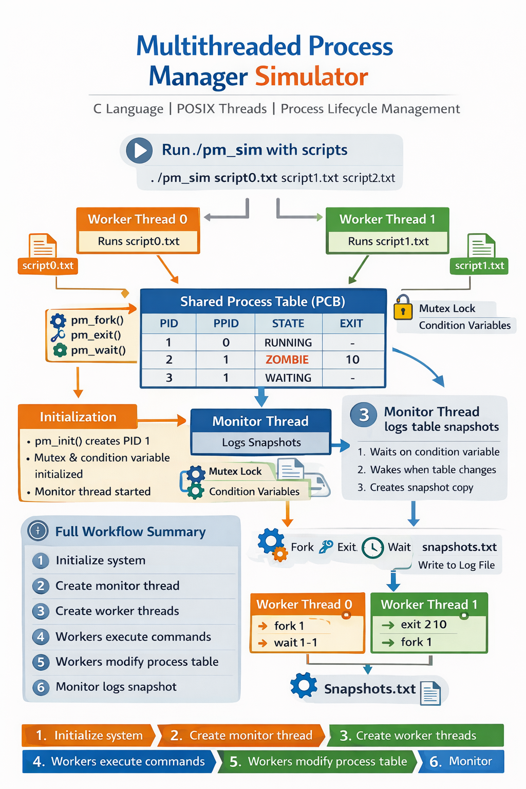

# Multithreaded Process Manager Simulator

A **Process Manager Simulator written in C using POSIX Threads (pthreads)** that models how an operating system manages processes inside a shared process table.

The simulator demonstrates:

* concurrent process creation
* process termination
* parent-child synchronization
* zombie handling
* safe multithreaded access
* automatic monitoring of process state changes

---

## Overview

This project simulates a simplified OS process subsystem where:

* each process is represented by a **PCB (Process Control Block)**
* multiple worker threads execute process operations concurrently
* a monitor thread automatically logs table changes
* synchronization prevents race conditions

---

## Architecture

The following workflow shows how worker threads, the shared process table, and the monitor thread interact inside the simulator.



### Workflow Summary

1. **System Initialization**

   * `pm_init()` creates the initial process (PID 1)
   * mutex and condition variable are initialized
   * monitor thread starts waiting for changes

2. **Worker Thread Creation**

   * each script file creates one worker thread
   * every worker reads commands independently

3. **Shared Process Table Access**

   * workers execute:

     * `pm_fork()`
     * `pm_exit()`
     * `pm_wait()`
     * `pm_kill()`
   * all access is protected by a mutex

4. **Monitor Notification**

   * every table modification triggers:
   * `notify_monitor()`
   * condition variable wakes monitor thread

5. **Snapshot Logging**

   * monitor copies the table safely
   * current state is written to `snapshots.txt`

---

## Process Lifecycle

```text id="8zubws"
RUNNING --> WAITING --> RUNNING
    |
    v
 ZOMBIE --> TERMINATED
```

### State Meaning

| State      | Description                      |
| ---------- | -------------------------------- |
| RUNNING    | Active process                   |
| WAITING    | Parent waiting for child         |
| ZOMBIE     | Child exited, waiting for parent |
| TERMINATED | Removed from system              |

---

## Features

* Maximum **64 simulated processes**
* Parent-child process hierarchy
* Automatic PID allocation
* Wait for:

  * specific child
  * any child
* Recursive process kill
* Monitor thread logging
* Mutex protected shared resources
* Condition-variable signaling
* Event-driven snapshot generation

---

## Supported Commands

Each worker thread reads commands from a script file.

### fork

Creates a child process.

```bash id="v0gvbn"
fork <parent_pid>
```

Example:

```bash id="9abfdg"
fork 1
```

---

### exit

Terminates a process.

```bash id="5ifznv"
exit <pid> <status>
```

Example:

```bash id="np0mov"
exit 2 10
```

---

### wait

Wait for a child.

```bash id="x0fn9d"
wait <parent_pid> <child_pid>
```

Example:

```bash id="0gejds"
wait 1 3
```

Wait for any child:

```bash id="9dri4u"
wait 1 -1
```

---

### kill

Force terminate a process.

```bash id="764ogk"
kill <pid>
```

Example:

```bash id="ogdiqf"
kill 4
```

---

### sleep

Pause worker thread.

```bash id="ka7yur"
sleep <milliseconds>
```

Example:

```bash id="78s3on"
sleep 200
```

---

## Build

Compile using GCC:

```bash id="q06cti"
gcc pm_sim.c -o pm_sim -lpthread
```

---

## Run

Example:

```bash id="8osym8"
./pm_sim thread0.txt thread1.txt thread2.txt
```

Each file is executed by a separate worker thread.

---

## Example Input Scripts

### thread0.txt

```text id="5vqb2q"
fork 1
sleep 200
wait 1 -1
```

### thread1.txt

```text id="yunn8w"
sleep 100
exit 2 10
```

---

## Example Output

The monitor thread writes snapshots to:

```text id="822fts"
snapshots.txt
```

Example:

```text id="8d7k1i"
Thread 1 calls pm_exit 2 10
PID     PPID    STATE       EXIT_STATUS
---------------------------------------
1       0       RUNNING     -
2       1       ZOMBIE      10
```

---

## Synchronization Strategy

The simulator protects the shared process table using:

| Primitive         | Purpose                            |
| ----------------- | ---------------------------------- |
| `pthread_mutex_t` | Protect process table              |
| `pthread_cond_t`  | Notify monitor and waiting parents |

### Why this matters

Without synchronization:

* corrupted process table
* missed wakeups
* inconsistent snapshots
* race conditions

---

## Internal Components

### Process Manager

Handles:

* `pm_fork()`
* `pm_exit()`
* `pm_wait()`
* `pm_kill()`
* `pm_ps()`

---

### Worker Threads

Each worker:

1. reads a script file
2. parses commands
3. executes process operations

---

### Monitor Thread

The monitor:

1. sleeps until notified
2. copies process table safely
3. writes snapshots to file

No busy waiting is used.

---

## Educational Concepts Demonstrated

This project demonstrates:

* Operating system process management
* Parent-child process relationships
* Zombie process handling
* Thread synchronization
* Condition variables
* Shared memory safety
* Event-driven design

---

## What I Learned

Through this project, I gained practical experience in:

* implementing **multithreaded systems in C**
* using **POSIX threads (pthreads)** for concurrent execution
* protecting shared resources with **mutex locks**
* coordinating threads using **condition variables**
* designing a simplified **process lifecycle model**
* managing **parent-child process relationships**
* handling **zombie processes and process reaping**
* avoiding **race conditions** in shared data structures
* building an **event-driven monitor thread**
* structuring a larger systems-level C program

This project strengthened my understanding of how operating systems internally manage processes while improving my confidence in low-level concurrent programming.

---

## Future Improvements

Possible enhancements:

* PID reuse
* process priorities
* scheduling simulation
* orphan process adoption
* command-line interactive mode
* colored terminal output

---

## License

Licensed under the **MIT License**.

---

## Author

**Hafiz**
Systems Programming | Operating Systems | Multithreading
